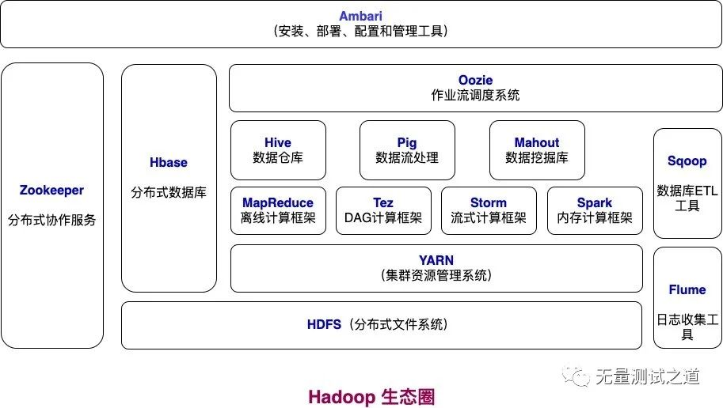
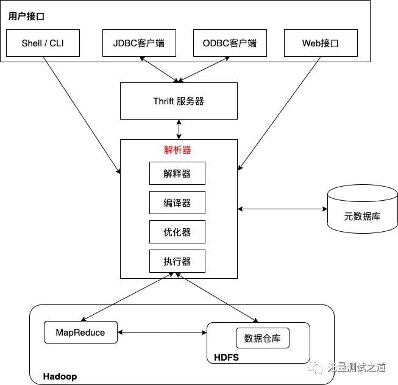
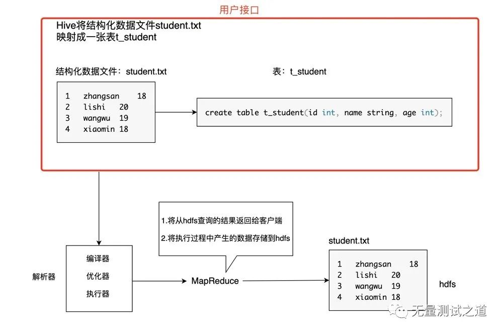

#  HIVE于hadoop到底是什么的简介
本文借鉴：1.https://cloud.tencent.com/developer/article/2040352

## 总结
个人总结，HIVE就是HADOOP数据库的操作系统，可以自动处理一些底层事务，同时也是用户使用的结构化查询的客户端。

### （一）背景
弄清楚HIVE对于Hadoop而言到底是个什么作用，以及HIVE各版本之间的功能差异。
***

### （二）HIVE之于Hadoop到底是个什么，HIVE的简介
Hive 提供标准的 SQL 功能，Hive 的 SQL 也可以通过用户定义的函数(UDF)，用户定义的集合(UDAF)和用户定义的表函数(UDTF)扩展为用户代码。换句话来说，Hive 是基于 Hadoop 的一个数据仓库工具，是用来管理数据仓库的。可以将结构化的数据文件映射为一张数据库表，并提供类 sql 的查询功能。   
Hive 构建在 Hadoop 之上，提供以下功能：
+ （1）通过类 SQL 指令轻松访问数据的工具，从而实现数据仓库任务，例如：提取/转换/加载(ETL)，报告和数据分析。
+ （2）一种将结构强加于各种数据格式的机制。
+ （3）直接访问存储在 HDFS 或其他数据存储系统（例如：HBase）中的文件。
+ （4）通过Tez, Spark, MapReduce执行查询。
+ （5）HPL-SQL的过程语言。
+ （6）通过Hive LLAP, YARN, Slider进行亚秒级查询检索。

从如下 Hadoop 生态圈图中可以看出 Hive 所扮演的角色。   

***

### （三）补充知识ETL是什么
ETL是Extract、Transform、Load的缩写，是一种常用的数据集成方法。ETL主要由以下三个组件组成：
+ Extract（数据提取），该组件负责从不同的数据源中提取数据。数据源可以是关系数据库、文件、Web服务、消息队列等。数据提取可以使用各种技术，例如数据库查询、文件读取、API调用等。
+ Transform（数据转换），该组件负责对提取的数据进行转换和清洗，以使其适合目标系统的数据结构和格式。数据转换可以包括数据清理、数据规范化、数据合并、数据拆分等操作。数据转换可以使用各种技术，例如SQL查询、脚本编程、ETL工具等。
+ Load（数据加载），该组件负责将转换后的数据加载到目标系统中，例如数据仓库、数据集市、关系数据库等。数据加载可以使用各种技术，例如SQL插入、批量加载、ETL工具等。   
***

### （四）HIVE时如何把一个结构化数据文件映射成一个数据表的

1. 有（1）数据文件中有固定的字段和（2）字段之间有固定的分隔符 这两个条件的的数据文件，就可称为结构化的数据文件，什么格式都可以，甚至是txt。    

2. 那么HIVE是如何把一个“结构化数据文件”映射成一张数据库的数据表的呢，这是因为HIVE将元数据信息应用到了一个“文件”上，从而使得一个HIVE的表对应了某个数据文件（并且定好了数据的格式）。
HIVE的元数据信息一般会存储在 mysql 或 derby 数据库中，其中会记录：（1）表和数据文件之间的对应关系。（2）表字段和文件字段之间的关系。

3. 元数据存放的路径在 hive-site.xml 文件里配置，找到对应存储的 mysql 库可以查询到表的元数据信息。可以在hadoop下用cat hive-site.xml命令查看。（我没成功找到目录）
***

### （五）HIVE作为用户的客户端接口
1. Hive可以使用类SQL指令对结构化数据文件进行分组查询，这个 sql 语句与常见的 mysql 语句是十分类似的，hive 里的 sql 语句也可称为 HQL，这里的 HQL 语句通过 hive 将查询语句转换为底层的 MapReduce 进行运算。   
Hive 的本质是将 Client 端提交的 sql 指令转换为 MapReduce 任务进行运算，在运算过程中会产生一些结果数据，这些结果数据在底层是使用 hdfs 来进行存储的。   
换句话来说，Hive可以认为是将 SQL 转换为 MapReduce 任务的一个工具，甚至可以说 hive 就是 MapReduce 的客户端。

2. HIVE作客户端的优点：   
+ 通过使用类 SQL 语法操作数据，提高开发效率；   
+ 避免开发人员写底层的 MapReduce，降低开发人员的学习成本；   
+ 具有十分强的扩展功能；

3. HIVE的架构：

为了更好地理解 Hive 的架构图，下图以一个实际的例子作为讲解。

