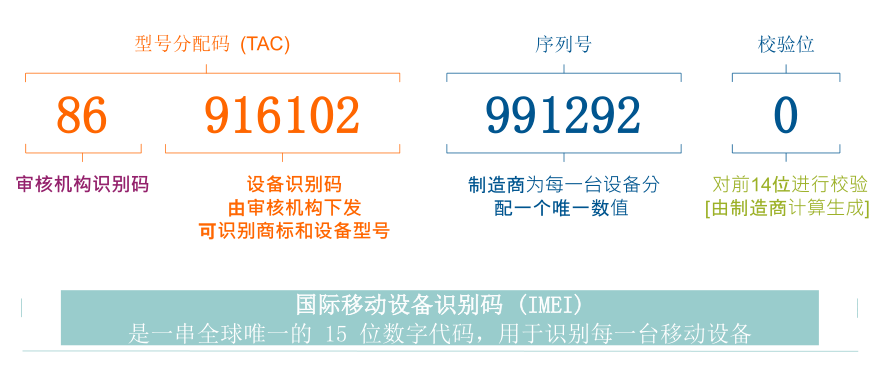

# TAC和国际移动识别码IMEI
本文借鉴内容：1.https://blog.csdn.net/soa20100121soft/article/details/127580099
2.https://blog.csdn.net/ouyang_peng/article/details/123925591

### （一）背景
在做prepaid用户handset null值匹配检查任务时，接触到用tac码来匹配设备的情况，之前遇到过了IMSI码，这次研究IMEI码。
***

### （二）国际移动识别码IMEI
国际移动设备识别码IMEI，International Mobile Equipment Identity，就是平时说的手机序列号，它是手机的身份证，可以在移动电话网络中识别手机等移动通信设备。它与每台移动电话机一一对应，而且该码是全世界唯一的。每一只移动电话机在组装完成后都将被赋予一个全球唯一的一组号码，这个号码从生产到交付使用都将被制造生产的厂商所记录。   
IMEI码由五个部分 TAC， FAC， SNR，CD， SVN五个部分，共15-17位数字组成。

1.第一部分 TAC，Type Allocation Code，类型分配码，由8位数字组成（早期是6位），是区分手机品牌和型号的编码，该代码由GSMA及其授权机构分配。其中TAC码前两位又是分配机构标识（Reporting Body Identifier），是授权IMEI码分配机构的代码，如01为美国CTIA，35为英国BABT，86为中国TAF。

2.第二部分 FAC，Final Assembly Code，最终装配地代码，由2位数字构成，仅在早期TAC码为6位的手机中存在，所以TAC和FAC码合计一共8位数字。FAC码用于生产商内部区分生产地代码。

3.第三部分 SNR，Serial Number，序列号，由第9位开始的6位数字组成，区分每部手机的生产序列号。

4.第四部分 CD，Check Digit，验证码，由前14位数字通过Luhn算法计算得出。

5.第五部分 SVN，Software Version Number，软件版本号，区分同型号手机出厂时使用的不同软件版本，仅在部分品牌的部分机型中存在。
***

### （三）TAC码的一些特点
TAC是型号分配码，也是IMEI（国际移动设备识别码）的号头。TAC可识别设备型号、商标所有者和生产厂商。所以在handset任务中匹配手机的时候可以截取IMEI前8位来作为TAC匹配。
一个TAC可生成100万个IMEI100万个IMEI使用完后，须申请新的TAC
***

### （四）与IMSI的区别
详见讲IMSI那页，简单讲就是IMSI唯一确定SIM卡，IMEI唯一确定物理手机。
